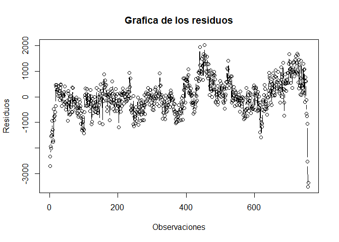
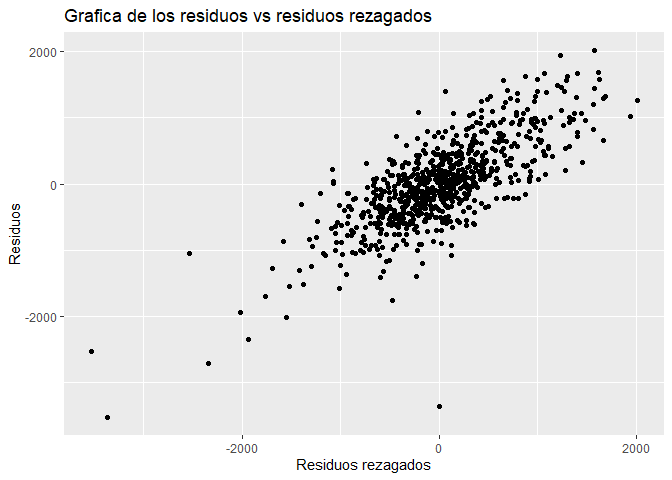
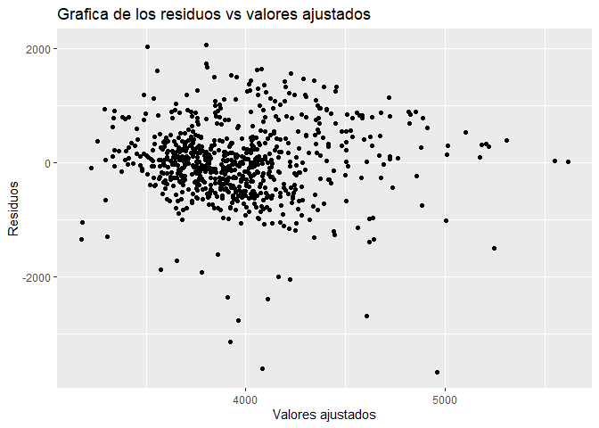
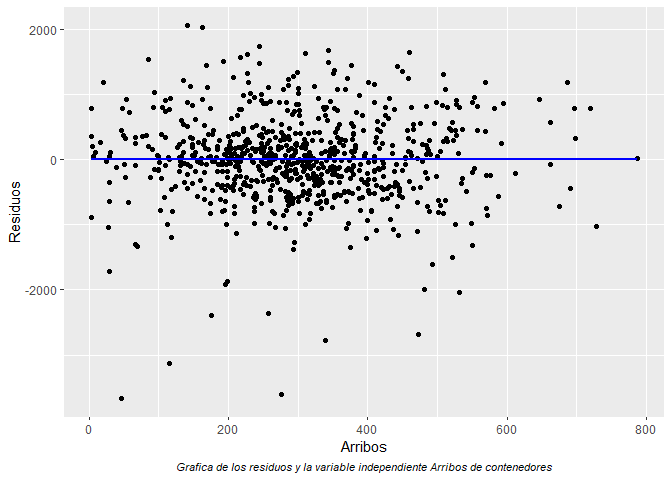
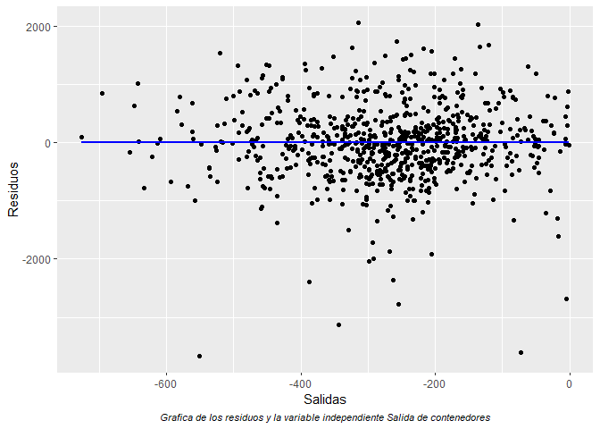
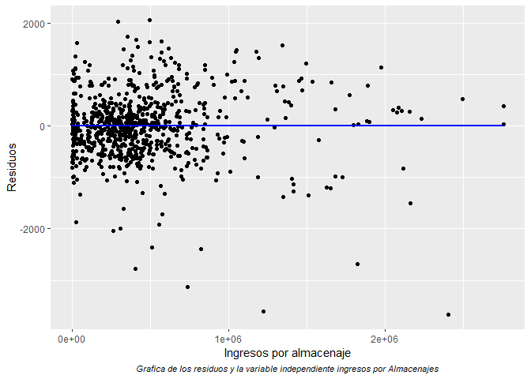
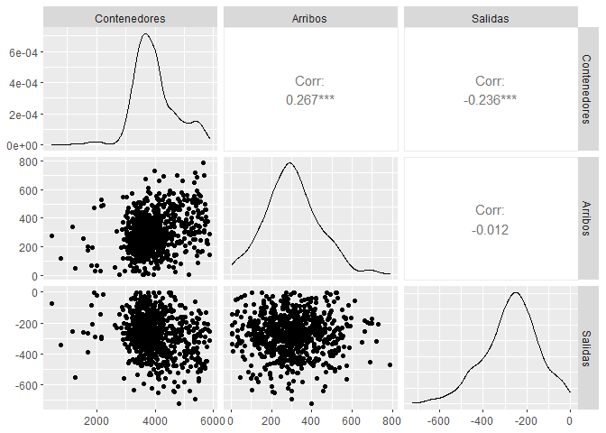
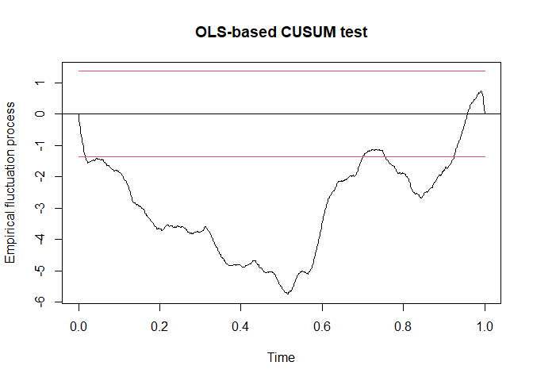

Trabajo final Seccion B: Ciencia de Datos: Modelos Predictivos I
================

## INTRODUCCIÓN

Actualmente el trafico de contenedores en los patios de una empresa
multimodal esta incrementandose, provocando una saturación en los
mismos. Se analizará la ocupación por número de contenedores de los
patios, a traves del tiempo de estadia, el arribo y salida de
contenedores y los ingresos generados por almacenaje.

Se entiende como tiempo de estadia a los días que un contenedor
permanece en el patio multimodal desde su llegada hasta su salida y los
ingresos generados por almacenaje como un servicio que cobra la empresa
por almacenar el contenedor un determinado tiempo.

Las unidades de medida de las variables son:

Tiempo de estadia: \[dias\]  
Arribo de contenedores: \[# de contenedores\]  
Salida de contenedores: \[# de contenedores\]  
Ingresos por almacenaje: \[miles de pesos mexicanos\]  
Trafico de contenedores: \[# de contenedores en inventario\]

Se utilizara un modelo de regresión lineal multiple ya que este permite
evaluar la influencia que se tienen entre las variables de interes, asi
mismo se utilizara para predecir el valor de nuestra variable de interes
que es la ocupación a traves de las variables independientes.

## Modelo de regresion lineal de la ocupación de patios

Se cargan los datos y definimos el modelo de la siguiente manera:

``` r
modeloOcupacion <- lm(Contenedores ~ TiempoEstadias + Arribos + Salidas + almacenaje_presupuesto,data = Database)
summary(modeloOcupacion)
```

    ## 
    ## Call:
    ## lm(formula = Contenedores ~ TiempoEstadias + Arribos + Salidas + 
    ##     almacenaje_presupuesto, data = Database)
    ## 
    ## Residuals:
    ##     Min      1Q  Median      3Q     Max 
    ## -3524.2  -374.9    -8.2   351.7  2011.6 
    ## 
    ## Coefficients:
    ##                          Estimate Std. Error t value Pr(>|t|)    
    ## (Intercept)             2.286e+03  1.690e+02  13.531  < 2e-16 ***
    ## TiempoEstadias          3.027e+01  6.788e+00   4.459 9.49e-06 ***
    ## Arribos                 1.532e+00  1.813e-01   8.448  < 2e-16 ***
    ## Salidas                -1.245e+00  1.884e-01  -6.610 7.29e-11 ***
    ## almacenaje_presupuesto  6.048e-04  5.873e-05  10.298  < 2e-16 ***
    ## ---
    ## Signif. codes:  0 '***' 0.001 '**' 0.01 '*' 0.05 '.' 0.1 ' ' 1
    ## 
    ## Residual standard error: 656.4 on 753 degrees of freedom
    ## Multiple R-squared:  0.2357, Adjusted R-squared:  0.2317 
    ## F-statistic: 58.06 on 4 and 753 DF,  p-value: < 2.2e-16

## Interpretacion de los coeficientes

| **Coeficiente** | **Valor**   | **Interpretación**                                                                                                        |
|-----------------|-------------|---------------------------------------------------------------------------------------------------------------------------|
| *b0*            | *2286*      | *Es el numero de contenedores promedio que se encuentran en el patio Intermodal sin intervencion de las demas variables.* |
| *b1*            | *30.27*     | *El incremento en un dia de estadia aumentara en 30.27 contenedores.*                                                     |
| *b2*            | *1.532*     | *El incremento en una unidad de arribos aumentara en 1.532 contenedores.*                                                 |
| *b3*            | *-1.245*    | *El incremento en una unidad de salidas diminuira en 1.245 contenedores.*                                                 |
| *b4*            | *0.0006048* | *El incremento en una unidad de almacenaje aumentara en 0.0006048 contenedores.*                                          |

#### Pruebas de significancia individual

Para realizar la prueba de significancia individual de los parametros
debemos tomar en cuenta la siguiente hipotesis:  
H0: bi = 0  
H1: bi \<\> 0

| \*\*Pr(\> | t                  |
|-----------|--------------------|
| *p(b0)*   | *2e-16 \< 0.05*    |
| *p(b1)*   | *9.49e-06 \< 0.05* |
| *p(b2)*   | *2e-16 \< 0.05*    |
| *p(b3)*   | *7.29e-11 \< 0.05* |
| *p(b4)*   | *2e-16 \< 0.05*    |

Como se puede ver, rechazamos H0 con 95% de confianza, es decir, todas
las variables del modelo son significativas al 95 %.

#### Prueba de significancia conjunta

Para realizar la prueba de significancia conjunta de los parametros
debemos tomar en cuenta la siguiente hipotesis:  
H0: b0 = b1 = B2 = 0  
H1: b0 \<\> b1 \<\> b2 \<\> 0

| []()                    |
|-------------------------|
| *p = 2.2 e-16 \< 0.05 * |

Como se puede ver, rechazamos H0 con 95% de confianza, es decir, nuestro
modelo sugiere que al menos una de las variables independientes en el
modelo tiene un efecto significativo en la variable dependiente con un
95 % de significancia.

#### Coeficiente de determinacion

| []()           |
|----------------|
| *R^2 = 0.2357* |

Por el coeficiente de determinación podemos concluir que el 20.13 % de
mi modelo esta explicado por las variables independientes.

Dado que el modelo muestra parametros significativos de manera
individual y conjunta, se realizaran pruebas para detectar los
principales problemas que presentan los MRLM(Modelos de Regresión Lineal
Multiple).

### Autocorrelación

La autocorrelacion se presenta cuando existe una relacion lineal entre
los residuos del presente con los residuos del pasado, evalúa si existen
patrones o tendencias repetitivas en los datos.Si se presenta
autocorrelación podria generarse un patron en los residuos y generar una
falla en las estimaciones, o tener sobrevalorados los parametros.

Existen varios metodos para determinar que el modelo presenta
autocorrelacion.

#### Metodo Gráfico

``` r
plot(modeloOcupacion$residuals, type = "b" , main = "Grafica de los residuos", xlab = "Observaciones", ylab = "Residuos")
```

<!-- -->

Podemos observar en la grafica, los residuos al parecer tienen un
patron, no se ven aleatorios, los residuos no son ruido blanco.

Acontinuacion graficamos los residuos rezagados un periodo y se centra
la grafica en cero contra los residuos:

``` r
qplot(x = c(tail(modeloOcupacion$residuals,-1),0), y = modeloOcupacion$residuals, main = "Grafica de los residuos vs residuos rezagados", xlab = "Residuos rezagados", ylab = "Residuos") 
```

<!-- -->

Podemos observar una tendencia creciente. Existe una relacion lineal
entre los residuos y los residuos rezagados.

Podemos observar claramente un patron en la grafica, lo mas recomendable
es aplicar un contraste que permita concluir de manera contundente la
existencia de autocorrelación.

#### Contraste BG(breusch-Godfrey)

Utilizaremos el contraste BG(breusch-Godfrey), ya que podemos definir el
orden del rezago, lo anterior para poder determinar en donde se
encuentra la autocorrelacion.

Tomando en cuenta la siguiente Hipotesis:  
H0: No existe autocorrelacion de orden 1  
H1: Existe autocorrelacion de orden 1

``` r
bgtest(modeloOcupacion, order = 1)
```

    ## 
    ##  Breusch-Godfrey test for serial correlation of order up to 1
    ## 
    ## data:  modeloOcupacion
    ## LM test = 500.15, df = 1, p-value < 2.2e-16

Como p= 2.2e-16 \< 0.05 podemos rechazar H0, es decir, podemos concluir
que existe autocorrelacion.

### Atenuación de la Autocorrelación

Se utilizará el metodo NeweyWest, el cual sirve para encontrar los
verdaderos errores estandar de la regresion, libre de autocorrelacion.

``` r
coeftest(modeloOcupacion, vcov = NeweyWest(modeloOcupacion))
```

    ## 
    ## t test of coefficients:
    ## 
    ##                           Estimate  Std. Error t value  Pr(>|t|)    
    ## (Intercept)             2.2863e+03  7.7211e+02  2.9611 0.0031616 ** 
    ## TiempoEstadias          3.0270e+01  3.5610e+01  0.8500 0.3955780    
    ## Arribos                 1.5319e+00  2.8898e-01  5.3010 1.515e-07 ***
    ## Salidas                -1.2452e+00  2.0883e-01 -5.9628 3.810e-09 ***
    ## almacenaje_presupuesto  6.0481e-04  1.6844e-04  3.5906 0.0003513 ***
    ## ---
    ## Signif. codes:  0 '***' 0.001 '**' 0.01 '*' 0.05 '.' 0.1 ' ' 1

En la siguiente tabla podemos observar que los parametros no se
modifican, pero los errores estandar se muestran libre de
autocorrelacion. Por tal motivo los valores de la prueba de
significancia se modifican.

| **Coeficiente** | **Valor**   | **Error Standard** | **Error Standard NeweyWest** | **Prueba de significancia NeweyWest** |
|-----------------|-------------|--------------------|------------------------------|---------------------------------------|
| *b0*            | *2286*      | *169*              | *772.11*                     | *0.0031616*                           |
| *b1*            | *30.27*     | *6.788*            | *35.61*                      | *0.3955780*                           |
| *b2*            | *1.532*     | *0.1813*           | *0.28898*                    | *1.515e-07*                           |
| *b3*            | *-1.245*    | *0.1884*           | *0.20883*                    | *3.810e-09*                           |
| *b4*            | *0.0006048* | *0.00005873*       | *0.00016844*                 | *0.0003513*                           |

Tomando en cuenta los resultados anteriores, el parametro b1, asociado
al tiempo de estadia, no es significativo, y p(b1) = 0.3955780 \>
0.05\*, no podemos rechazamos H0: b1 = 0. Las demas betas se siguen
considerando.

Por lo anterior se modifica el modelo, quedando de la siguiente manera:

``` r
modeloOcupacion <- lm(Contenedores ~ Arribos + Salidas + almacenaje_presupuesto,data = Database)
summary(modeloOcupacion)
```

    ## 
    ## Call:
    ## lm(formula = Contenedores ~ Arribos + Salidas + almacenaje_presupuesto, 
    ##     data = Database)
    ## 
    ## Residuals:
    ##     Min      1Q  Median      3Q     Max 
    ## -3668.8  -356.7    -4.5   337.6  2059.9 
    ## 
    ## Coefficients:
    ##                          Estimate Std. Error t value Pr(>|t|)    
    ## (Intercept)             2.949e+03  8.143e+01  36.216  < 2e-16 ***
    ## Arribos                 1.447e+00  1.826e-01   7.928 8.03e-15 ***
    ## Salidas                -1.214e+00  1.906e-01  -6.367 3.34e-10 ***
    ## almacenaje_presupuesto  5.297e-04  5.696e-05   9.300  < 2e-16 ***
    ## ---
    ## Signif. codes:  0 '***' 0.001 '**' 0.01 '*' 0.05 '.' 0.1 ' ' 1
    ## 
    ## Residual standard error: 664.6 on 754 degrees of freedom
    ## Multiple R-squared:  0.2155, Adjusted R-squared:  0.2124 
    ## F-statistic: 69.06 on 3 and 754 DF,  p-value: < 2.2e-16

### Heterocedasticidad

La heterocedasticidad se refiere a la presencia de variabilidad desigual
en la dispersión de los errores del modelo.  
Cuando se presenta heterocedasticidad, las estimaciones de los
coeficientes del modelo pueden ser sesgadas y las pruebas de
significancia pueden ser incorrectas, generando:  
- Riesgo en la Toma de Decisiones.  
- Necesidad de Ajustes.  
- Mejora de la Precisión.

De igual forma que para la autocorrelación, existen varios metodos para
determinar que el modelo presenta Heterocedasticidad:

#### Metodo gráfico

Para tener una perspectiva visual de la presencia de heterocedasticidad
graficamos los residuos contra los valores ajustados.

``` r
qplot(x=modeloOcupacion$fitted.values,
      y=(modeloOcupacion$residuals),  main = "Grafica de los residuos vs valores ajustados", xlab = "Valores ajustados", ylab = "Residuos")+
  geom_point() 
```

<!-- -->

No se aprecia un patrón entre los residuos y el valor ajustado, se
realizaran gráficas para cada variable.

``` r
qplot(x= Database$Arribos,
      y=(modeloOcupacion$residuals),  xlab = "Arribos", ylab = "Residuos")+
  geom_point()+
   geom_smooth(method = "lm", se = FALSE, color = "blue")+
  labs(caption = "Grafica de los residuos y la variable independiente Arribos de contenedores") +
    theme(plot.caption=element_text(size=8, hjust=0.5, face="italic", color="black"))
```

    ## `geom_smooth()` using formula 'y ~ x'

<!-- -->

``` r
qplot(x= Database$Salidas,
      y=(modeloOcupacion$residuals),  xlab = "Salidas", ylab = "Residuos")+
  geom_point()+
   geom_smooth(method = "lm", se = FALSE, color = "blue")+
  labs(caption = "Grafica de los residuos y la variable independiente Salida de contenedores") +
    theme(plot.caption=element_text(size=8, hjust=0.5, face="italic", color="black"))
```

    ## `geom_smooth()` using formula 'y ~ x'

<!-- -->

``` r
qplot(x= Database$almacenaje_presupuesto,
      y=(modeloOcupacion$residuals),  xlab = "Ingresos por almacenaje", ylab = "Residuos")+
  geom_point()+
   geom_smooth(method = "lm", se = FALSE, color = "blue") +
  labs(caption = "Grafica de los residuos y la variable independiente ingresos por Almacenajes") +
    theme(plot.caption=element_text(size=8, hjust=0.5, face="italic", color="black"))
```

    ## `geom_smooth()` using formula 'y ~ x'

<!-- -->

Se ha revisado la heterocedasticidad por el metodo grafico, este muestra
los residuos en el eje vertical y la variable independiente (xi) en el
eje horizontal. Los puntos dispersos en el gráfico representan los
residuos de nuestro modelo de regresión lineal.

Se observa en la gráfica de “residuos y la variable independiente
ingresos por Almacenajes” que la dispersión de los residuos tiende a
aumentar a medida que avanzamos en la variable independiente (x), los
residuos se vuelven más dispersos a medida que x aumenta. Se agrega una
línea azul en el gráfico que muestra la dirección general en la que se
encuentra la relación entre x y los residuos.

Aun cuando se visualiza que existe heterocedasticidad, es necesario
comprobar con algun contraste.

Se utilizará el contraste Breusch-Pägan, donde la hipotesis es la
siguiente:

H0: Homocedasticidad  
H1: No homocedasticidad

``` r
bptest(modeloOcupacion)
```

    ## 
    ##  studentized Breusch-Pagan test
    ## 
    ## data:  modeloOcupacion
    ## BP = 38.375, df = 3, p-value = 2.354e-08

Como podemos observar, p = 2.2e-16 \< 0.05 por lo tanto rechazo H0, el
modelo tiene problemas de heterocedasticidad.

Ahora bien, utilizaremos el Contraste Goldfeld-Quandt, este indica que
si el b asociado a la variable es significativo entonces esa variable es
la que esta generando heterocedasticidad.

Se debe ordenar la base de datos para aplicar el contraste, se aplicara
dicho contraste a todas las variables:

``` r
gqtest(modeloOcupacion,order.by = ~Arribos,data = Database)
```

    ## 
    ##  Goldfeld-Quandt test
    ## 
    ## data:  modeloOcupacion
    ## GQ = 0.85495, df1 = 375, df2 = 375, p-value = 0.9352
    ## alternative hypothesis: variance increases from segment 1 to 2

``` r
gqtest(modeloOcupacion,order.by = ~Salidas,data = Database)
```

    ## 
    ##  Goldfeld-Quandt test
    ## 
    ## data:  modeloOcupacion
    ## GQ = 0.9422, df1 = 375, df2 = 375, p-value = 0.7177
    ## alternative hypothesis: variance increases from segment 1 to 2

``` r
gqtest(modeloOcupacion,order.by = ~almacenaje_presupuesto,data = Database)
```

    ## 
    ##  Goldfeld-Quandt test
    ## 
    ## data:  modeloOcupacion
    ## GQ = 2.1377, df1 = 375, df2 = 375, p-value = 1.858e-13
    ## alternative hypothesis: variance increases from segment 1 to 2

Podemos confirmar que para la variable de ingresos por almacenaje p =
1.858e-13 \< 0.05, por lo tanto rechazamos la H0: homocedasticidad, por
lo tanto existe Heterocedasticidad. Para las demas variables el valor p
\>0.05, no podemos rechazar la H0: homocedasticidad.

#### Atenuacion de Heterocedasticidad.

Utilizaremos el metodo error standard libre de heterocedasticidad, este
es un metodo no invasivo.  
Recordemos que el problema de la heterocedasticidad ocasiona que la
varianza sea sobreestimada, este metodo busca recuperar el error
estandard, de los cuales se extraen de la matriz de varianza y
covarianza, en otras palabras, lo que estamos haciendo es calcular los
errores estandar verdaderos, libres de heterocedasticidad.

``` r
modelohac <- coeftest(modeloOcupacion, vcov = vcovHC(modeloOcupacion))
modelohac
```

    ## 
    ## t test of coefficients:
    ## 
    ##                           Estimate  Std. Error t value  Pr(>|t|)    
    ## (Intercept)             2.9489e+03  7.8761e+01 37.4413 < 2.2e-16 ***
    ## Arribos                 1.4474e+00  2.1112e-01  6.8558 1.476e-11 ***
    ## Salidas                -1.2136e+00  2.1173e-01 -5.7321 1.435e-08 ***
    ## almacenaje_presupuesto  5.2973e-04  8.7091e-05  6.0825 1.880e-09 ***
    ## ---
    ## Signif. codes:  0 '***' 0.001 '**' 0.01 '*' 0.05 '.' 0.1 ' ' 1

podemos notar que todos los coeficientes son significativos, si
comparamos el modelo inicial podemos notar que los errores estandard
estan sobre estimados:

| **Coeficiente** | **Valor**   | **Error Standard** | **Error Standard HAC** | **Prueba de significancia HAC** |
|-----------------|-------------|--------------------|------------------------|---------------------------------|
| *b0*            | *2948.9*    | *81.43*            | *78.76*                | *2.2e-16*                       |
| *b1*            | *1.4474*    | *0.1826*           | *0.2111*               | *1.476e-11*                     |
| *b2*            | *-1.2136*   | *0.1906*           | *0.21173*              | *1.435e-08*                     |
| *b3*            | *0.0005297* | *0.00005696*       | *0.000087091*          | *1.880e-09*                     |

Acontinuacion utilizando diferentes métodos de corrección de
heterocedasticidad (HC0, HC1, HC2, HC3, HC4). Estas desviaciones
estándar corregidas son útiles para evaluar la precisión de las
estimaciones de los coeficientes en presencia de heterocedasticidad en
el modelo.

``` r
t(sapply(c("HC0", "HC1", "HC2", "HC3", "HC4"), # transponemos 
         function(x) sqrt(diag(vcovHC(modeloOcupacion, type = x)))))
```

    ##     (Intercept)   Arribos   Salidas almacenaje_presupuesto
    ## HC0    78.01951 0.2083404 0.2087860           8.503202e-05
    ## HC1    78.22619 0.2088923 0.2093391           8.525727e-05
    ## HC2    78.38822 0.2097207 0.2102452           8.605149e-05
    ## HC3    78.76116 0.2111250 0.2117277           8.709129e-05
    ## HC4    78.92827 0.2126133 0.2133498           8.892076e-05

Con lo anterior lo que queremos saber cual de mis 4 tipos de correccion
de la matriz de var y cov, varian los errores estandar de mi modelo,
notamos que los bi no varian tanto para los diferentes tipos de
correcion de la matriz.

#### Influencia

Generamos los intervalos de confianza del modelo y del modelo atenuando
la heterocedasticidad:

``` r
sum_Ocupacion <- summary(modeloOcupacion)

ls_O1 <- sum_Ocupacion$coefficients[4]+1.96*sum_Ocupacion$coefficients[,2][4]
li_O1 <- sum_Ocupacion$coefficients[4]-1.96*sum_Ocupacion$coefficients[,2][4]

ls_O2 <- modelohac[4]+1.96*modelohac[,2][4]
li_O2 <- modelohac[4]-1.96*modelohac[,2][4]
Int_conf <- data.frame(ls_O1,li_O1,ls_O2,li_O2)
names(Int_conf)[1] <- "Limite inf"
names(Int_conf)[2] <- "Limite Sup"
names(Int_conf)[3] <- "Limite inf HAC"
names(Int_conf)[4] <- "Limite Sup HAC"

kable(Int_conf)
```

|                        | Limite inf | Limite Sup | Limite inf HAC | Limite Sup HAC |
|:-----------------------|-----------:|-----------:|---------------:|---------------:|
| almacenaje_presupuesto |  0.0006414 |  0.0004181 |      0.0007004 |       0.000359 |

Notamos que los intervalos no varian demasiado uno con respecto del
otro. Talvez el problema de heterocedasticidad no afecta demasiado al
modelo.

### Multicolinealidad

La multicolinealidad se presenta cuando las variables independientes
estan relacionadas linealmente entre si, provocando dificultad en la
identificación del efecto individual de cada variable independiente
sobre la variable dependiente, llevando estimaciones sesgadas de los
coeficientes de regresión y resultados poco fiables.

Para la identificación de la multicolinealidad tenemos los siguientes
metodos:

#### Matriz de correlacion

La matriz de correlacion muestra el coeficiente de correlacion entre las
variables, cuando los valores se acercan a -1, 1 indican correlacion
entre las varriables

``` r
Matriz_Corr <- cor(Database[2:4],use = "complete.obs")

kable(Matriz_Corr)
```

|              | Contenedores |    Arribos |    Salidas |
|:-------------|-------------:|-----------:|-----------:|
| Contenedores |    1.0000000 |  0.2668833 | -0.2362936 |
| Arribos      |    0.2668833 |  1.0000000 | -0.0119236 |
| Salidas      |   -0.2362936 | -0.0119236 |  1.0000000 |

Notamos que los valores no son cercanos a -1, 1

#### Grafico de coeficientes de correlación

Grafico que muestra distribucion en la diagonal,los graficos de
dispersion en la diagonal inferior y los coeficientes de correlacion en
la diagonal superior

``` r
ggpairs(Database[2:4])
```

<!-- -->

De igual forma notamos que los valores no son cercanos a -1, 1

#### Factor VIF: Variance inflation factor

El VIF evalúa cuánto aumenta la varianza de los estimadores de los
coeficientes de regresión debido a la multicolinealidad, cuanto mayor
sea el VIF de una variable independiente, mayor será la
multicolinealidad de esa variable con las otras en el modelo.

``` r
Factor_VIF <- vif(modeloOcupacion)
kable(Factor_VIF)
```

|                        |        x |
|:-----------------------|---------:|
| Arribos                | 1.000903 |
| Salidas                | 1.008200 |
| almacenaje_presupuesto | 1.008878 |

si se tiene un VIF \> 10 podriamos tenemos multicolinealidad, no son
cercanos a 10, no presenta multicolinealidad.

Finalmente se tiene que validar con los contrastes complementarios

### NORMALIDAD EN RESIDUOS

Supuesto necesario para pruebas de hipotesis de los coeficientes.

Utilizaremos el contraste jarque Bera, tomando en cuenta que:

H0: normalidad  
H1: no normalidad

``` r
jarque.test(as.vector(modeloOcupacion$residuals))
```

    ## 
    ##  Jarque-Bera Normality Test
    ## 
    ## data:  as.vector(modeloOcupacion$residuals)
    ## JB = 492.89, p-value < 2.2e-16
    ## alternative hypothesis: greater

Como podemos ver p = 2.2e-16 \< 0.05 se rechaza la H0, por lo tanto mi
modelo no sigue una distribucion normal.

### PARAMETROS ESTABLES

Cuando se realiza un modelo, es necesario verificar la estabilidad a
traves del tiempo.Este no puede ser utilizado si el modelo no es estable
en todos sus parametros.

Se utilizará el Contraste de estabilidad CUSUM: cumulative sums of
standarized residuals.

si el modelo no es estable en los parametros, el grafico saldra de los
limites(lineas rojas): intervalos de confianza. si fluctua dentro del
intervalo tampoco es lo mas deseable, nos gustaria que no hubiera
fluctuaciones, que no existan quiebres estructurales

``` r
ols <- efp(modeloOcupacion, data = Database, 
           type = "OLS-CUSUM")
plot(ols)
```

<!-- -->

Como se observa en la grafica, el comportamiento es muy volatil, el
grafico sale de los limites no se recomienda utilizar el modelo.

### MODELO CORRECTAMENTE ESPECIFICADO

Cuando se habla de especificación, se refiere a si los parametros son
lineales. Si las variables no son lineales, talvez se tendrian que
aplicar una transformacion. Por otro lado, si el modelo no esta
correctamente especificado, las variables podrian ser redundantes o se
podría estar omitiendo variables, y habria algun tipo de sesgo.

Se utilizará el contaste ramsey reset, donde las hipotesis son:

H0: modelo correctamente especificado.  
H1: modelo no especificado correctamente.

``` r
resettest(modeloOcupacion)
```

    ## 
    ##  RESET test
    ## 
    ## data:  modeloOcupacion
    ## RESET = 2.1447, df1 = 2, df2 = 752, p-value = 0.1178

Podemos ver que p = 0.1178 \> 0.05, no rechazo H0, mi modelo esta
especificado correctamente.
